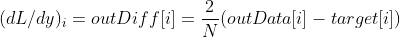
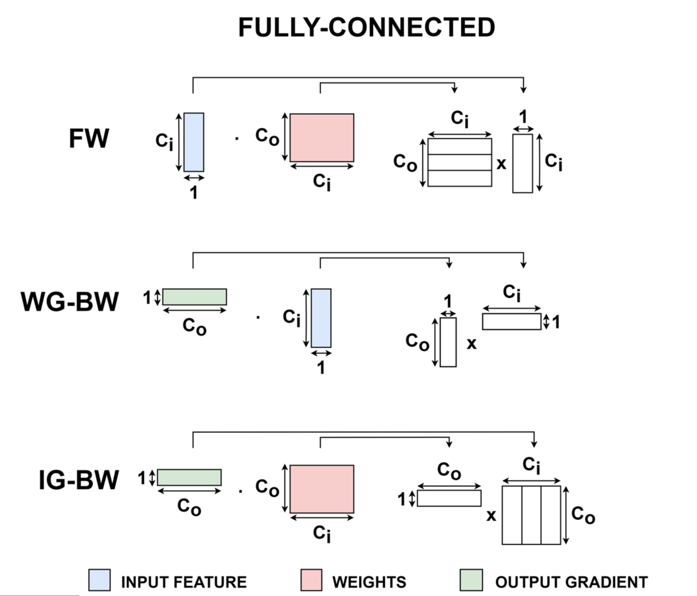
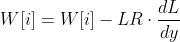

# APAI On-Device Learning Lab

**Assignment DEADLINE: 15/11/2024 (at 14:30)**

## How to deliver the assignment:

Use Virtuale, upload only the assignment file named as follows:

`LAB#_APAI_name1_name2.ipynb`

___

## Quickstart

### How to set the environment

1. Open the VirtualBox virtual machine
2. Open a terminal (CTRL+T or open terminal)
3. Launch the commands (clone repo, move into folder, open Visual Studio Code):
```
git clone https://github.com/EEESlab/APAI24-LAB04-PULP-NN
cd APAI24-LAB04-PULP-NN/
code .
```
4. Now you're ready to start!

#### How to run the code
**[DO NOT FORGET]** Every time you open a new terminal run:

`source setup_pulp_sdk.sh`

To run the code enter in a terminal

`make clean all run`

___

# LAB starts here!

In this lab you will learn how to code a simple On-Device Learning (ODL) workload on a PULP-based System-on-Chip. In this exercise, you will train a simple Deep Neural Network on a sample data and label, and you will profile its performances over an epoch of training.

First, the DNN architecture is the following:
- Conv2D layer
- ReLU activation
- Fully-Connected layer (classifier)

In this test, the reference data (i.e., the input data, the expected output and the label) is generated by a (Golden Model)[utils/GM.py] or GM, which is written in Python/PyTorch. Running the GM will trigger the creation of several .h files which contain the data to be fed to the C code, and will serve to train and validate the DNN.

To compile the project, run:
`rm -rf BUILD/; make clean get_golden all run`.

During the exercise, check carefully the existing functions in [net.c](net.c)!! They are VERY useful!!

As a reference for this exercise, please point to [PULP-TrainLib](https://github.com/pulp-platform/pulp-trainlib).

## Exercise 0: Print and analyze the reference data

Here, you will familiarize with the input and output data. To start, print the input and the label, which will be used to make the DNN learn. First, compile with `rm -rf BUILD/; make clean get_golden all run` from you terminal. Then, complete the `print_input()` and `print_label()` in [net.c](net.c), then use them into `net_step()` to print the arrays. Once you compiled the first time, you can find the data you're looking for into [io_data.h](io_data.h).

QUESTIONS:
- 0A) What is the size of the input data?
- 0B) What values are contained in the input data?
- 0C) What is the size of the label?
- 0D) What values are contained in the label?

## Exercise 1: Forward prediction

You will now perform a forward prediction with the non-initialized DNN. If you look at [net.c](net.c), the `forward()` function performs a forward prediction by calling all layers in sequence. Each layer computes its output, using the previous data provided by the previous layer in sequence. The first layer takes the input data as input, and the output of the last layer is the DNN's prediction. Let's see what happens inside.

First, modify the `net_step()` function to perform a forward prediction. The, print the output of the DNN.

QUESTIONS:
- 1A) Does the output of the DNN approximate the ideal label?

Then, let's evaluate the performances of the DNN. To have a very good estimate of the latency of a given workload, let's monitor PULP's Performance Counters. In practice, these counters count the number of events of a given type, e.g., the clock cycles to execute a program, the number of instructions, and more. Performance Counters are managed by the macros contained in [stats.h](stats.h). To start measuring the stats, call `START_STATS()`. To stop and print the stats, call `STOP_STATS()`.

NOTE: Be careful not to profile functions/workloads which contain `printf()` functions!! They take so many clock cycles to execute that you WILL END UP misreading the performances of your code!!

QUESTIONS:
- 1B) How many clock cycles does the forward take?
- 1C) How many instructions?
- 1D) How high is the IPC (instruction-per-cycle)?
- 1E) The number of MAC operations of the DNN is 10656. How many are the MAC/cycle to execute the forward?

## Exercise 2: Loss Function

Now, it's time to start working on the backpropagation!! First of all, we need to compute the loss function to compute the prediction error of our forward function with respect to the ground-truth label.

Let's dig a bit into the code of PULP-TrainLib: [lib/sources/pulp_losses_fp32.c](lib/sources/pulp_losses_fp32.c), in the function `pulp_MSELoss()`. You will complete the code of a MSELoss! Its formula is:


In our code, 1/N is already computed as `meanval`. Complete the code to compute the loss. When you're done, you can visualize the value of the loss by uncommenting the line `APP_CFLAGS += -DDEBUG_LOSS` inside the [Makefile](Makefile).

QUESTIONS:
- 2A) What is the value of the loss (this may vary from run to run)?

Now, we need to make the loss function compute the output gradient of the DNN. To do so, let's consider its expression:



Complete the code with the output gradient.

QUESTIONS:
- 2B) What is the value of the output gradient (this may vary)?

Now, COMMENT the `APP_CFLAGS += -DDEBUG_LOSS` or you will have printf()s during the training!!!

## Exercise 3: Backward step

In this exercise, you will learn how to design the backward steps of an On-Device Learning primitive, and how to call it!!

Let's start top-down: the sequence of operations during the backward step is reversed with respect to the forward. That's because we want to bring the output gradient towards the input, and compute the gradient of the weights! The sequence of layers to be backpropagated is contained into the `backward()` function in [net.c](net.c). Looking at the `forward()` function as a reference, complete the `backward()` function for the whole network. You can look into [the library](lib/include/) to find the forward and backward primitives (e.g., [conv2d fp32](lib/include/pulp_conv2d_fp32.h)).

Now, uncomment `print_gradients()` and compile the code. You will see that the gradients are all zeroes. Why? Because the primitives of the fully-connected (or linear) do not compute any gradient at all! Let's implement the two steps. In most training backends, the fully-connected training steps - i-e., the forward, weight grad and input grad - are computed as matrix multiplication. In case of a Fully-Connected, the three steps are expressed as follows:



On the right, you have the matrix expressions of the three training steps. Note that, in the code, N is the number of rows of the left matrix, K is the shared size (columns of the first, rows of the second) and M is the number of columns of the matrix on the right. Complete the primitives of the [fully-connected](lib/sources/pulp_linear_fp32.c).

When you're done, compile the code again. Now the gradients should be computed for all the DNN!! If so, comment the `print_gradients()` function. Now, profile the `backward()` with the performance counters.

QUESTIONS:
- 3A) How many cycles does it take to compute the backward?
- 3B) How many instructions?
- 3C) IPC?
- 4D) The total MAC are 27360. MAC/cycle?

Now, remove/comment the profiling functions around the backward to continue.

## Exercise 4: Weight Update

Now, let's move to the weight update! After computing the weight gradient, you can now update the weights and enhance the DNN! You can do it with the `update_weights()` function. What this function does is calling the optimizer - here the Gradient Descent - to update the weight using the formula:



The formula is called only on layers which possess weights (i.e., not the ReLU!). Now, you will set the function to call the weight update to the correct layers. In PULP-TrainLib, the data is contained into 1-D arrays that store the tensors. To wrap the tensors, a `struct blob` is defined for each tensor, containing both their data and the gradients. Complete the code of `update_weights()` in [net.c](net.c) with the most suitable blobs to update the DNN.

Now, print the weights of the last layer before and after the update, using `print_weights()`.

QUESTION
- 4A) Do you notice any difference in the weights values before and after the update?

To complete Exercise 4, comment all the `printf()` and `print_weights()` around the `update_weights()` function.

## Exercise 5: Training the classifier

Now, let's finally run a training! You will test the convergence of the DNN against the sample input and label generated by the GM. To start this exercise, uncomment the code at the bottom of [net.c](net.c) (both the profiling an the last block of `net_step()`). BE CAREFUL TO HAVE THE PRINTS COMMENTED AS SUGGESTED IN EXERCISE 4! The dataset, in this case, is composed of a single data. Therefore, the training will iterate on this only sample for a given number of epochs, to test the convergence and validate the model.

First, let's define the `learning_rate` and the `epochs` hyperparameters in [GM.py](utils/GM.py). Leave the `batch_size` to 1, as we have a single sample. Note that `batch_size = 1` is a common setup for training DNNs on Microcontrollers, due to the very limited amount of available memory (i.e., the single sample is acquired and we learned, then it's discarded).

When you call the compilation command, the GM will set the C code to execute the training with the given hyperparameters. Now, compile the code with `learning_rate = 0.5`, `epochs = 1`:

QUESTIONS:
- 5A) How many cycles does it take to perform the training loop?
- 5B) Which percentage of cycles takes to execute the forward?
- 5C) Which percentage of cycles takes to execute the backward?
- 5D) Does the output of the updated DNN approximate the label?

Now, set `learning_rate = 1`, `epochs = 400`:

- 5E) How many cycles does it take to perform the training loop?
- 5F) Is it coherent with the number of epochs?
- 5G) Does the output of the updated DNN approximate the label?

## END

Thank you for attending the lab. I hope you enjoyed it!
